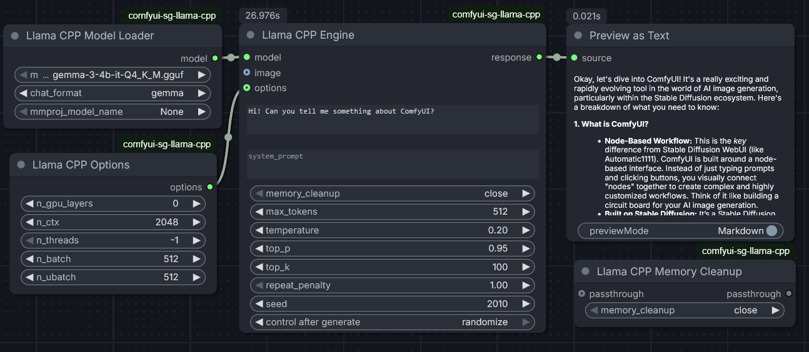

# comfyui-sg-llama-cpp

ComfyUI custom node that acts as a llama-cpp-python wrapper, with support for vision models. It
allows the user to generate text responses from prompts using llama.cpp.



## Features

- Load and use GGUF models (including vision models)
- Generate text prompts using llama.cpp
- Support for multi-modal inputs (images)
- Memory management options
- Integration with ComfyUI workflows

## Installation

1. Install the required dependency/wheel from:
   ```
   https://github.com/JamePeng/llama-cpp-python/releases
   ```

2. Clone this repository into your ComfyUI custom nodes directory:
   ```bash
   cd ComfyUI/custom_nodes
   git clone https://github.com/sebagallo/comfyui-sg-llama-cpp
   ```

3. Restart ComfyUI.

## Usage

This custom node provides four main components:

### LlamaCPPModelLoader
- Loads GGUF model files from ComfyUI's `text_encoders` folder and optional custom folders
- Supports various chat formats
- Optional multi-modal projector support for vision models

### LlamaCPPOptions
- Configures model parameters like:
  - GPU layers
  - Context window size
  - Thread count
  - Batch sizes

### LlamaCPPEngine
- Generates text responses from prompts
- Supports vision inputs for compatible models
- Configurable generation parameters (temperature, top_p, etc.)
- Memory cleanup options

### LlamaCPPMemoryCleanup
- Manually manages memory usage
- Various cleanup modes available

## Custom Model Folders

By default, the node loads GGUF models from ComfyUI's `text_encoders` folder. You can optionally specify additional folders to load models from by creating a `config.json` file in the custom nodes directory.

### Configuration

1. Create a file named `config.json` in the same directory as this README
2. Add your custom model folders in the following JSON format:

```json
{
  "model_folders": [
    "C:\\Users\\YourUsername\\models",
    "D:\\AI\\LLM\\models",
    "/home/user/models"
  ]
}
```

### Notes

- The `config.json` file is **optional** - the node works without it
- Paths can be absolute or relative
- Both Windows (`C:\`) and Unix (`/`) style paths are supported
- Non-existent paths are automatically filtered out
- Models from all folders (ComfyUI's `text_encoders` + your custom folders) will appear in the model selection dropdown
- See `config.example.json` for additional examples

## Requirements

- ComfyUI
- llama-cpp-python (from https://github.com/JamePeng/llama-cpp-python)

## License

This project is licensed under the GNU AGPLv3 License - see the [LICENSE](LICENSE) file for details.

## Repository

https://github.com/sebagallo/comfyui-sg-llama-cpp
